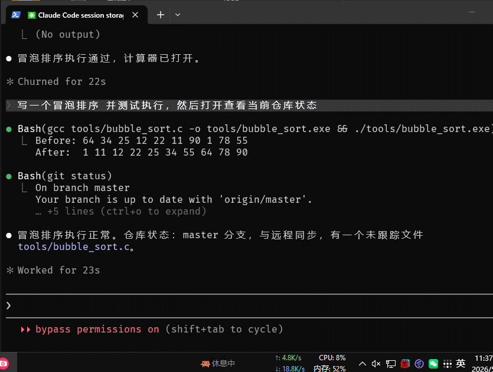

<p align="center">
  
</p>

<h1 align="center">TaskPin</h1>

<p align="center">
  把任何信息钉在 Windows 任务栏上。<br>
  纯 C + Lua 脚本驱动，单文件 450KB，零依赖。
</p>

<p align="center">
  <a href="https://github.com/bestK/taskpin/releases/latest">Download</a> |
  <a href="README.md">English</a> |
  <a href="docs/LUA_API.md">API 文档</a> |
  <a href="https://github.com/bestK/taskpin-plugins">插件市场</a>
</p>

---

## 它能做什么

写一段 Lua 脚本，TaskPin 就把结果显示在任务栏里。比如：

```lua
-- 监控 Claude Code 工作状态
return icon("claude.png", 16, 16) .. font(" 想一想", "#FFAA00", 9)
```

```lua
-- 系统资源一览
local cpu = sys.cpu()
local mem = sys.memory().percent
return font("CPU:" .. cpu .. "%", "#0F0", 9) .. font(" MEM:" .. mem .. "%", "#FA0", 9)
```

```lua
-- AI API 余额查询
local r = json.decode(http.get("https://api.example.com/balance"))
return font("$" .. r.balance, "#4FC3F7", 10)
```

点击还能弹出详情面板——支持图文混排、表格、透明悬浮窗：

```lua
return bar, true, dialog({
    borderless = true, opacity = 200,
    content = {
        { type = "text", value = "Claude Code", image = "claude.png", image_width = 16, image_height = 16 },
        { type = "table", columns = {"指标", "值"}, rows = {{"CPU", "45%"}, {"MEM", "8GB"}} },
    }
})
```

## 特性

| | |
|---|---|
| **任务栏嵌入** | 直接嵌入底部任务栏，不占桌面空间 |
| **Lua 脚本驱动** | 想显示什么就写什么，内置 HTTP/JSON/系统监控 API |
| **插件市场** | 一键浏览和下载社区脚本 |
| **富文本 + 图片** | 多色文字、PNG/GIF 动画、左右对齐、双行显示 |
| **弹出对话框** | 点击展开详情面板，支持图文混排、表格、HUD 悬浮窗 |
| **多 Bar 并排** | 同时 Pin 多个脚本，各自独立刷新 |
| **零依赖** | 纯 C + Win32 API + Lua 5.4 静态链接，单文件 ~450KB |
| **自动更新** | 静默检测新版本，下载替换重启 |

## 快速开始

1. 下载 [最新 Release](https://github.com/bestK/taskpin/releases/latest)
2. 运行 `taskpin.exe`
3. 双击任务栏嵌入条 → 打开管理窗口
4. 点击 **Market** 浏览插件，或 **Add** 手动添加脚本
5. **Pin to Bar** 即可显示

## 快捷操作

| 操作 | 快捷键 |
|------|--------|
| 调整 bar 宽度 | 鼠标悬停 bar + 滚轮 |
| 移动 bar 位置 | Shift + 滚轮 |
| 拖动无边框对话框 | Shift + 拖动 |
| 缩放无边框对话框 | Shift + 滚轮 |
| 关闭无边框对话框 | ESC（鼠标悬停时） |

## 示例脚本

<p align="center">
  
  <br><em>claude_status.lua — 在任务栏实时显示 Claude Code 工作状态</em>
</p>

| 脚本 | 用途 |
|------|------|
| [`claude_status`](examples/claude_status.lua) | Claude Code 实时工作状态 |
| [`system_monitor`](examples/system_monitor.lua) | CPU + 内存 + 网速 |
| [`net_monitor`](examples/net_monitor.lua) | 网络进程流量监控 |
| [`hud_clock`](examples/hud_clock.lua) | 桌面悬浮时钟 (透明 + 穿透) |
| [`newapi_balance`](examples/newapi_balance.lua) | AI API 余额查询 |
| [`zentao_task`](examples/zentao_task.lua) | 禅道待办任务 |
| [`oracle_sessions`](examples/oracle_sessions.lua) | Oracle 数据库会话监控 |

更多脚本见 [插件仓库](https://github.com/bestK/taskpin-plugins)。

## 写一个脚本

```lua
-- @param city string 城市名
-- @refresh 60000

local r = json.decode(http.get("https://wttr.in/" .. args.city .. "?format=j1"))
local temp = r.current_condition[1].temp_C
local desc = r.current_condition[1].weatherDesc[1].value

return font(temp .. "°C " .. desc, "#4FC3F7", 9), true, dialog({
    title = args.city,
    width = 280, height = 120,
    content = {
        { type = "text", value = args.city .. " " .. temp .. "°C", size = 14, bold = true },
        { type = "text", value = desc, color = "#AAAAAA", size = 10 },
    }
})
```

`@param` 声明参数（UI 自动生成输入框），`@refresh` 设置刷新间隔。就这么简单。

## 文档

- [Lua API 参考（中文）](docs/LUA_API.md)
- [Lua API Reference (English)](docs/LUA_API_EN.md)

## 编译

```bash
# MinGW-w64 + GNU Make
make
```

## License

[MIT](LICENSE)

[](https://linux.do/)